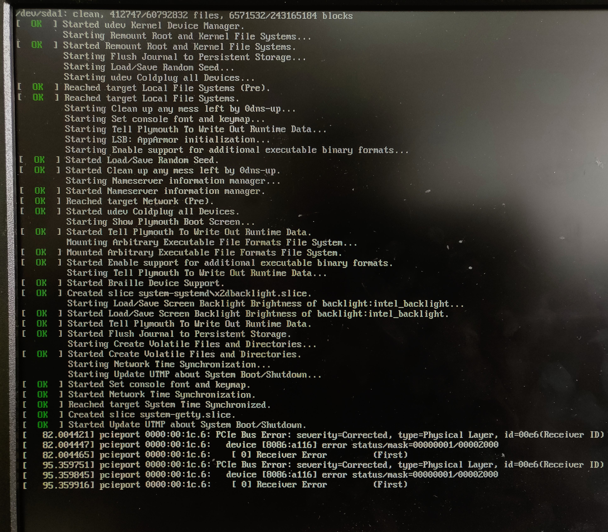

# 开机的过程都发生了什么

没有程序运行的计算计就是一堆破铜烂铁的电子器件。打开计算机要做的就是开启一个特殊的程序---操作系统。操作系统的任务是通过管理复杂的计算机硬件，帮助其他的计算机程序运行。

> 开机其实就是启动操作系统，那么怎样启动操作系统呢？

开启操作系统的过程叫做`Booting`，计算机知道怎样`booting`是因为`booting`的指令都在`BIOS`(Basic Input/Output System)芯片里。

BIOS芯片首先硬件自检，然后查找外部储存的顺序后，告诉计算机，`booting`的详细过程我其实不知道，但是我知道booting的详细过程（说明书）可能在哪几个地方可以找到（排名有先后）---该地方的固定的位置---通常在硬盘的最小号(最前面的一个 扇区)，有一个特殊的程序叫`boot loader`(在`Linux`，叫做`Grub`或者`LILO`)。计算机把`boot loader`加载到内存运行，`boot loader`的任务就是真正的开启操作系统。

计算机通过`boot loader`告诉计算机操作系统存放在设备的那个扇区，找到`kernel`、加载到内存并且运行，开启操作系统。在Linux如果你看到LILO，后面还跟着一堆点，这就是说在加载kernel，每一个节点代表着加载了一个磁盘块。

一旦kernel启动，计算机就开始找其他的硬件，并且准备运行程序。计算机不是通过普通的内存位置，而是通过I/O端口---特殊的总线地址，可能会有设备控制器卡等待命令。`autoprobing` 

你可能看不到以上过程的任何信息。退回到使用Unix系统的文本模式`Ctrl-Shift-F1`，你就会看到随着系统开启，boot信息在屏幕滚动。现在*nix系统通常使用图形化界面，隐藏boot信息。

boot 期间报出的绝大多数的信息是kernel在你的IO端口硬件autoprobing，kernel得出哪一个是可使用，然后应用在你的机器，Linux非常擅长，优于绝大多数Unix系统，比DOS，Windows好得多。

但是kernel完全加载和运行并不是boot过程的结束，这只是第一个阶段（run level 1），第一个阶段后，内存把控制权交给叫做`init`的进程，该进程产生了系统基本的几个进程。

`init`进程的第一个工作通常是检查一下磁盘是否OK。磁盘文件系统很脆弱，如果因为硬件损坏或者是突然断电而被损坏，就需要花步骤恢复。

`init`的第二个步骤是开启几个守护进程。这些特殊程序常常需要协调可能冲突的几个请求。这些进程随着系统不同而不同，但是都会有`print spooler`(打印后台处理服务)进程，毕竟计算机总得让人知道他在做写什么吧！

再下一个步骤是为用户而准备，`init`开启一个程序的拷贝叫做`getty`，用来监视屏幕和键盘。

还没有结束，下一步是开启各种支持网络和其他设备的守护进程，其中最重要的是X server（Linux提供界面），X是管理展示、键盘和鼠标的进程，主要工作是产生你在屏幕上看到的彩色象素图形。

### reference

 https://www.tldp.org/HOWTO/Unix-and-Internet-Fundamentals-HOWTO/bootup.html

http://www.ruanyifeng.com/blog/2013/02/booting.html