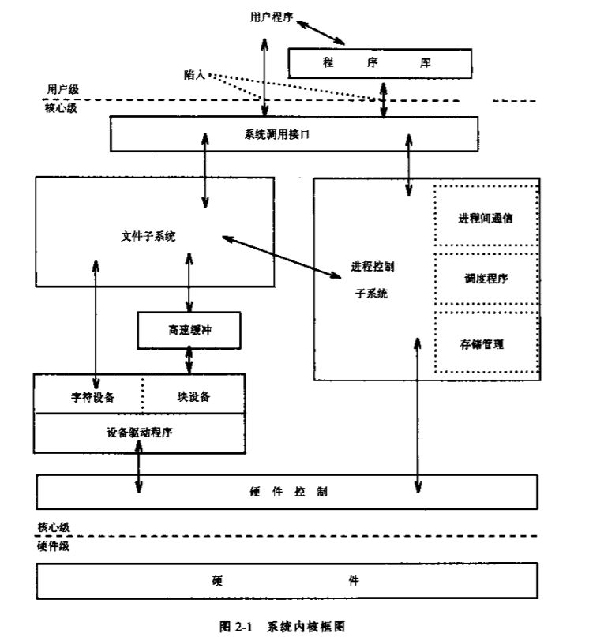

# Kernal

> 究竟什么是内核  OS和内核有什么关系



内核介于硬件和用户级之间，有两部分组成：文件子系统、进程控制子系统

### 文件子系统

如图中左侧部分所示，文件系统一部分通过缓冲机制存取数据文件，一部分直接访问原始I/O设备（除`块设备`外的设备）。`设备驱动程序`是控制外围设备操作的内核模块。eg磁带驱动程序可以允许内核把磁带作为一个随机存取存储设备。

##### 打开一个文件的过程

``` C
open('/fs2/jib/rje/sourcefile', 1)
```

文件名称 --> check 权限 --> 索引节点

##### 建立一个新文件

内核分配一个未使用的索引节点

文件表、用户文件描述表、索引节点表实现对一个文件的不同程度的存取共享。

### 进程控制子系统


