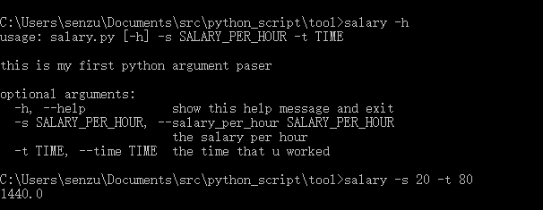

# 制作自己的脚本工具

狗狗去实习了，实习工资是按照小时计算的，每小时的薪水很不错，但是实习工资超过800的部分要扣20%的税（本来就不多……），所以想要根据工时计算自己能拿到多少钱还是有点麻烦的，按照能坐着就不站着，能躺着就不坐着的躲懒思想，狗狗决定自己写一个脚本，并且放在环境变量里，这样就能方便地算出自己能得到的钱了，然后想着什么时候能买个车回家呢？

## 编写核心程序

狗狗打开 sublime text，写下了如下程序

``` python
def salary(salary_per_hour,time):
	no_tax = salary_per_hour * time
	if no_tax > 800:
		no_tax = 800 + (no_tax-800) * 0.8
		# 160 + 0.8 * no_tax
	return no_tax
```

这简直就是Hello World级别的东西，太简单了！

## 完善程序为脚本

毕竟不能一直打开编辑器写入参数啊，狗狗想到了参数解析器，之前都只听其声未见其人，现在正好学一下。

1. 导入包

   ``` python
   import argparse
   ```

2. 创建解析器

   ``` python
   parser = argparse.ArgumentParser(description='this is my first python argument paser')
   ```

   `description`为输出参数信息前的输出信息

3. 添加参数

   ``` python
   parser.add_argument('-s', '--salary_per_hour', type=int, default=False, help='the salary per hour',required=True)
   parser.add_argument('-t', '--time', type=int, default=False, help='the time that u worked',required=True)
   ```

4. 解析参数

   ``` python
   arg = parser.parse_args()
   x = arg.salary_per_hour
   t = arg.time
   ```

5. 使用参数

   ``` python
   print(salary(x,t))
   ```

## 测试

在编写的当前目录，打开黑窗，输入`salary -h` 和`s  20 -t 80` 

80个小时扣完税只有1440，好少哦

## 添加到环境变量

可是使用脚本的时候总是打开这个目录也是很麻烦的，所以狗狗就把工具目录添加到了环境变量，这样的话就可以在任意目录使用脚本工具了。

系统->环境变量->添加Tool目录，完成！

## OVER


